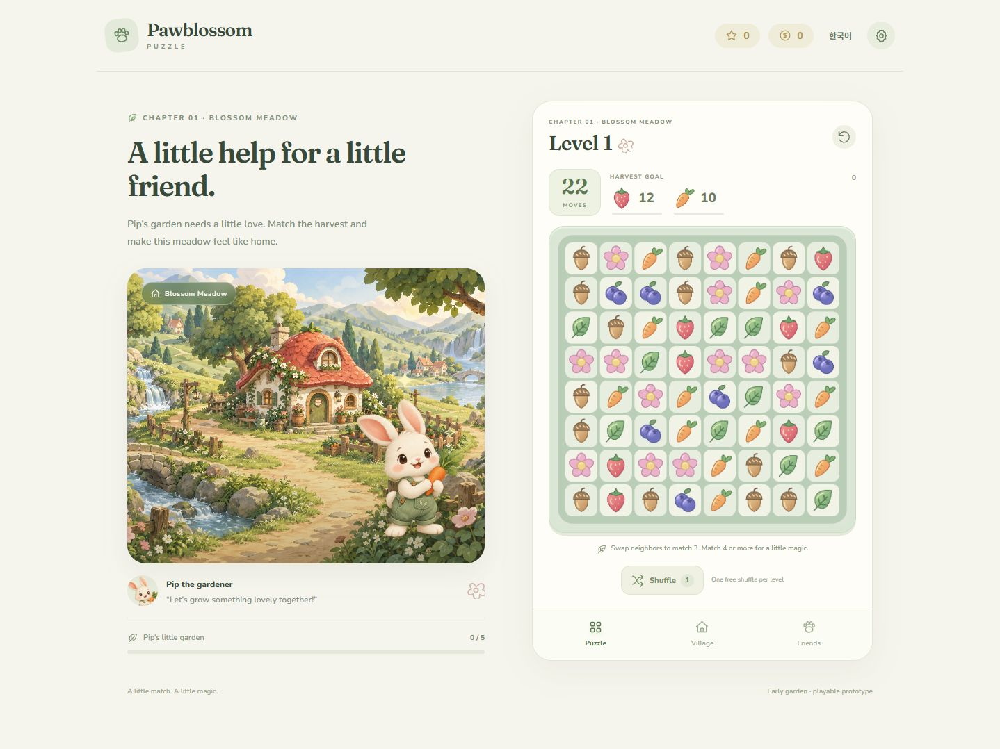

# Pawblossom Puzzle

귀여운 동물 친구들과 함께 숲속 마을을 가꾸는 포근한 매치3 퍼즐 게임입니다.

과일과 자연 소재 블록을 맞추고, 동물 친구들의 부탁을 해결하며 마을을 조금씩 완성해 나갑니다.

## 개발 방향

- **출시 목표:** 한국과 해외 시장을 대상으로 구글 플레이에 출시
- **게임 언어:** 영어를 기본 언어로 제작하고 한국어 지원
- **분위기:** 따뜻한 색감, 둥근 동물 캐릭터, 부드러운 연출
- **이용자:** 아이부터 중장년까지 편하게 즐길 수 있는 퍼즐을 지향
- **수익화 계획:** 광고와 광고 제거 일회성 결제
- **현재 상태:** 10개 스테이지를 갖춘 플레이 가능한 첫 시제품 (v0.1.0)

저장소의 소개와 개발 문서는 한국어로 작성합니다.



## 실행

Node.js 22 이상을 사용합니다.

```sh
npm ci
npm run dev
```

브라우저에서 터미널에 표시된 주소를 엽니다. 이웃한 두 블록을 탭하거나 한 칸 드래그하여 매칭합니다. 유효한 이동만 횟수를 소비하며, 4개·5개·T/L 매칭과 특수블록 조합을 지원합니다.

## 구현된 범위

- 8×8 보드, 연쇄 제거·낙하·힌트·막힌 보드 재배치, 스테이지별 무료 섞기
- 10개 수확 스테이지, 첫 완료 별·코인 보상, 별로 화단 가꾸기
- 영어·한국어, 설정·진행 로컬 저장 (진행 중 보드는 재실행 시 새로 시작)
- 독자적으로 생성한 숲속 배경·토끼, 자체 SVG 블록 6종
- 원본 Web Audio 배경음과 효과음 8종, 개별 음소거·백그라운드 중단
- Capacitor Android 프로젝트와 설치·번들 빌드 경로

```sh
npm test
npm run build
npm run android:sync
```

Android 빌드에는 Android SDK와 JDK가 별도로 필요합니다. [빌드와 출시 준비](docs/android-release.ko.md)를 참고해 주세요.

광고·광고 제거 결제·상점·장애물·튜토리얼·실기기 검증은 아직 구현/완료하지 않았습니다. 현재 APK는 테스트용이며 AAB를 만들더라도 업로드 키 서명과 출시 검수가 필요합니다.

## 개발 문서

- [기존 게임 조사와 창작 방향](docs/reference-research.ko.md)
- [에셋 출처와 생성 프롬프트](docs/assets.ko.md)
- [사운드 설계와 청취 점검](docs/audio-direction.ko.md)
- [독립 검토와 수정 기록](docs/prototype-review.ko.md)
- [다음 개발 순서](docs/roadmap.ko.md)

앞으로 생성하는 작업 세션은 **6.1 Sol · Medium**을 사용합니다. 상세 규칙은 [AGENTS.md](AGENTS.md)에 기록합니다.
